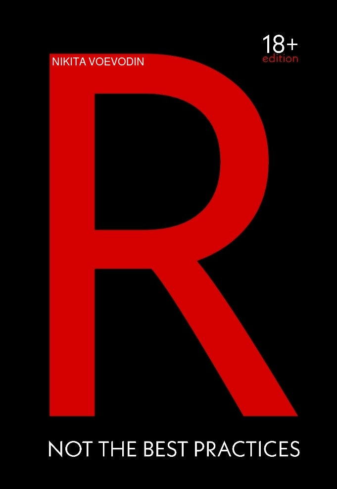

--- 
title: "R, Not the Best Practices"
author: "Nikita Voevodin"
date: "`r Sys.Date()`"
site: bookdown::bookdown_site
output: word_document
documentclass: book
always_allow_html: yes
bibliography: [book.bib, packages.bib]
biblio-style: apalike
link-citations: yes
colorlinks: yes
graphics: yes
github-repo: rstudio/bookdown-demo
description: "This is a minimal example of using the bookdown package to write a book. The output format for this example is bookdown::gitbook."
---

# Preface {-}

::: {.infobox .caution data-latex="{caution}"}

<a rel="license" href="http://creativecommons.org/licenses/by-nc-nd/4.0/"></a><br /><span xmlns:dct="http://purl.org/dc/terms/" property="dct:title">R, Not the Best Practices</span> by <span xmlns:cc="http://creativecommons.org/ns#" property="cc:attributionName">Nikita Voevodin</span> is licensed under a <a rel="license" href="http://creativecommons.org/licenses/by-nc-nd/4.0/">Creative Commons Attribution-NonCommercial-NoDerivatives 4.0 International License</a>.

:::


```{r echo = F, out.width= "65%", out.extra='style="float:right; padding:10px"'}

``` 

Welcome to "R, Not the Best Practices". You, probably, selected this book for one of the following three reasons. One, you saw the title and the cover and though that it was intersting and funny for the guide type of book to be called 'Not the Best Practices' and were curious to see what is inside. Two, you know that books that are called 'something something, best practices' are hard to follow, because they are written by someone who already forgot how it feels to not know shit and, therefore, describes things in a manner that is hard to follow. Third, someone referred you to this book, because they learned a lot from it themselves. I am hoping that your reason is somewhere between the second and third points. Although, even if it is the first, you will not regret it. 

Why is this book called 'Not the Best Practices'? Simple, you do not learn by looking at the perfect code. If I wrote a vectorized loop with a custom function and told you that this is the most efficient way of doing whatever I am doing, therefore, the best practice, you would never understand what the fuck was going on and would just switch off right there and then. That was my experience with the majority of tutorials that I went through. Every time, at some point, I would just stop getting what was going on. But, because I had invested some time and money into them, I would force myself through them regardless. Unfortunatelly, that tactic results in very little progress and a lot of frustration and discouragement. Writing this book, I want it to be nothing like those experiences. There will be some boring basic shit that I just muыt cover, but the majority of it will be practice and interaction driven. 

## What this book is and is not
- This book is not written by an academic.

I am not an R professor or creator of some fancy library. I am a professional data analyst and an R, SQL and Javascript practitioner.

- This book is not a set of best practices.

I do not care about the clengliness of your code, especially at this stage of your progress. The only thing that I care about is whether your code does the job. The best practices will come later. This book is a set of tips, tricks, hacks, and practices (good or bad) that will make things work for you when you need them to.

- This book will not filter words.

It is my belief that learning to code can be dull, boring, and discouraging. Therefore, I will try to maintain your interest by using some seasoned language here and there. So, if you are extra sensitive, this one might not be for you. In fact, there is a 'Vanilla' version of this book available. Ultimatelly, this book will show you how learning R and its components can be frustrating and will give you anecdotal tips on how to go about the grind.

- This book will not use stupid generic data.

I have seen and practiced with a bunch of stupid and semi-generic data that makes no fucking sence. That really traumatized me and I do not want you to experience the same pain. Not only we will be working with real data (real vehicles vin numbers, and NYPD car crash data across NYC), but also, we will be pulling that data from the real SQL database that I specifically set up for this book. So, you can be sure that we will not be writing stupid 'hello world' examples on every turn. By the end of this book you will have something interesting to show for the time that you invested. 

- This book is not only about R.

In a professional setup, R goes hand in hand with another language that is extreamly important. This language is SQL, the language of database interaction. To get our practice data, we will be using SQL database table and the SQL language to write commands. On top of that, I will also explaing a good deal about other programming languages and how they interact or do not interact with R.

- Finally, this book is not only for you. 

You see, when coding, after a while, you will begin to forget what you have learned or how you have built things. This book, therefore, will serve me as a reminder or documentation of things that I have done and built, and as a side effect it will teach you those things as well.  

## What will this book teach you

This book will follow my first three months of learning R at my new job. Before that point, I was ok with computers for playing games and using Microsoft Work and Excel for professional stuff. However, I did not know anything about programming, I did not know any programmers. Code for me was just that, a code. Since the memories of not knowing shit are still fresh in me, I feel quite confident that I should be able to put myself in your shoes and bring you to the level of proficiency that you should be at after learning R for three months. Yes, three months. This book will cover my first quarter of dealing with R and programming in general. 

If you are already thinking, 'Oh shit, this guy will only show me some basic stuff!', you are wrong. I will have to show you some basic stuff, there is no way around it, if you want to learn. However, the most of the book will be taken by the real life examples, things that you will be dealing with ninty five percent of a time. For instance, the core of this book revolves around the main assignment that I received in the second week of my employment. That assignment took me offguard and took me two months of non-stop learning of R and SQL to complete. By the end of that assignment I felt comfortable with the most tasks where I needed to work with data. I will leed you through the same experience with many tips and tricks along the way. You will learn how to interact with databases in R; pull data; aggregate and reshape it to your liking; merge it with other data; save it; work with different data and time formats; create useful static and dynamic plots; fit all that nice stuff into presentable reports; create shitty and great maps; use all that again to create dashboards; and finally build a simple web app as a bonus. Along the way, I will be telling you about mine and other programmer's experinces with some peripheral programming topics. 

If all that is not enough for you, feel free to close this book and get yourself something like 'R for Dummies' or some shit. This book is, ultimatelly, what and how I wanted to be taught when I was a noob.

::: {.infobox .important data-latex="{important}"}

Special thanks go to Fausto Lopez for proofreading this book. Fausto is a Director of Data Engineering & Analytics at NYC Taxi and Limousine Commission.

:::  


